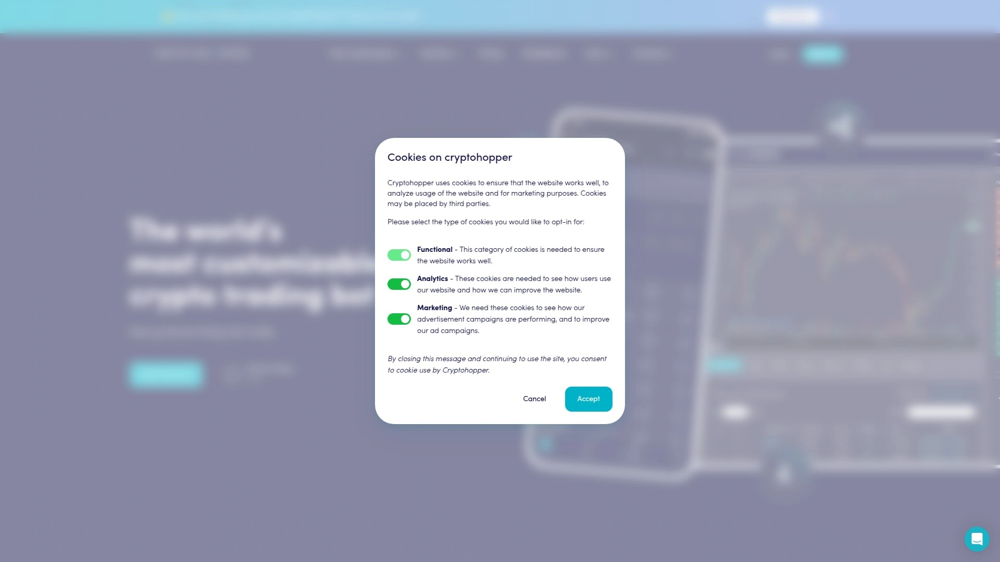
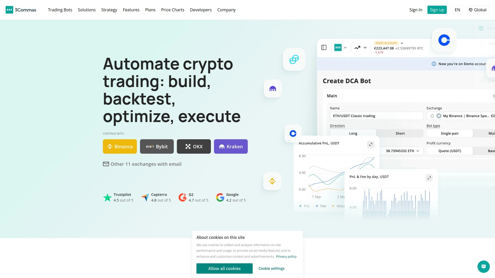
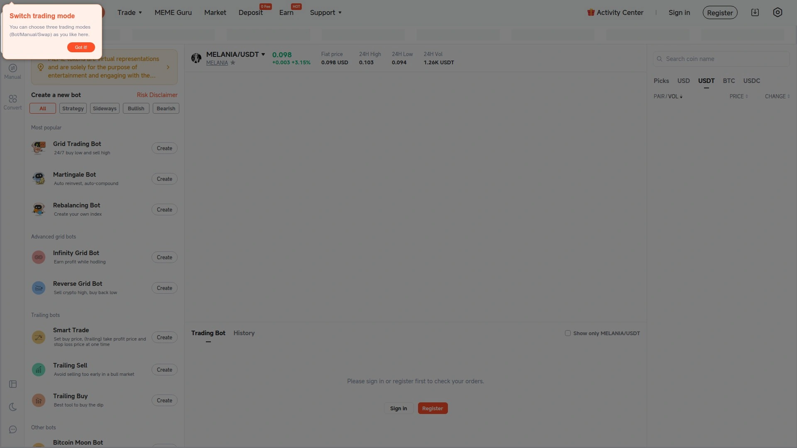
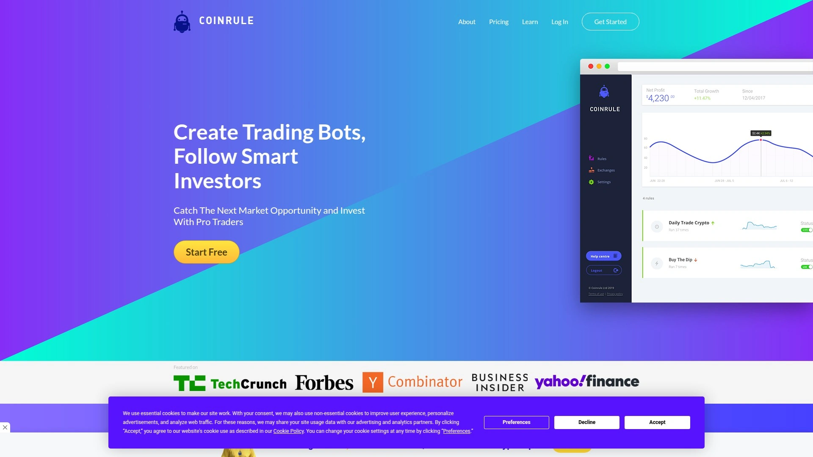
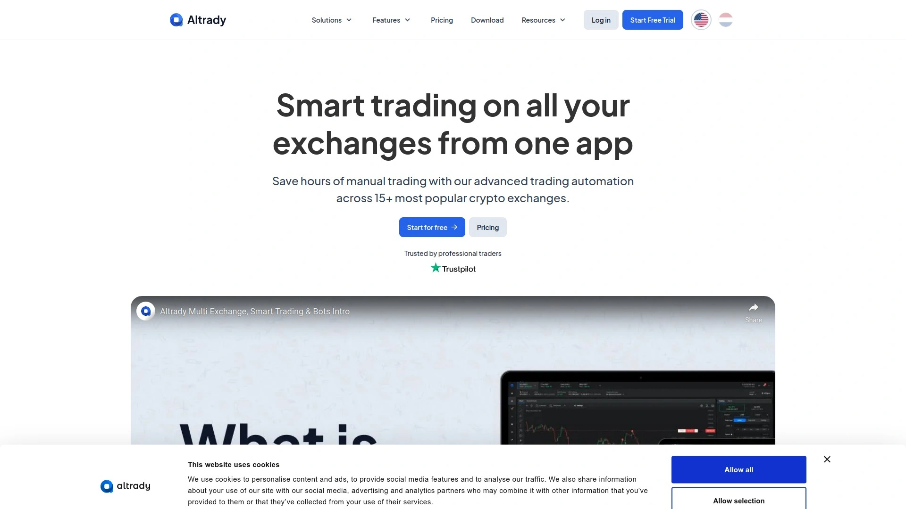
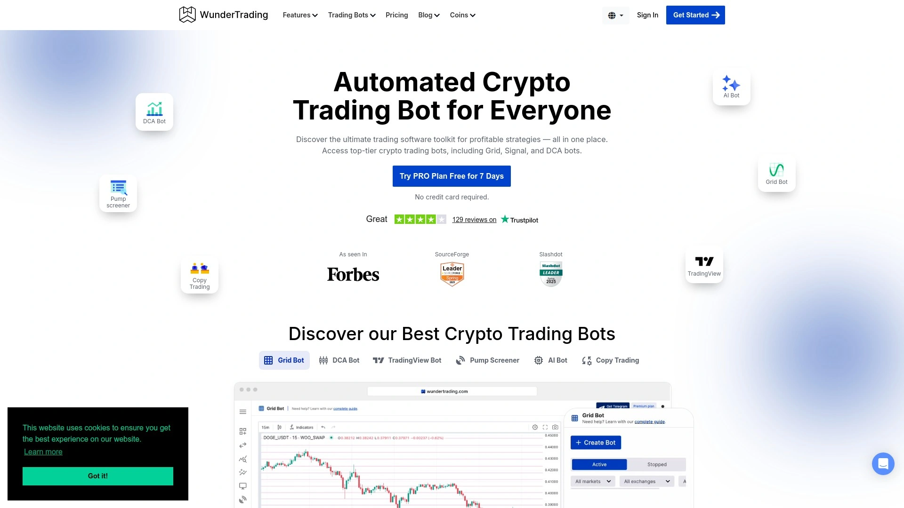

# 2025's Top 8 Best Automated Crypto Trading Platforms

Watching crypto markets 24/7 burns you out while automated traders capture every opportunity. Bitcoin pumps at 3 AM, altcoins crash during your lunch meeting, and profitable arbitrage windows close before you even refresh the page—manual trading simply can't compete with algorithms running continuously. Modern trading bots now handle everything from grid strategies to AI-powered pattern recognition, executing hundreds of trades daily without emotion, fatigue, or missed signals. Traders using automation report 40-60% better returns compared to manual approaches, while reclaiming countless hours previously spent staring at charts.

## **[Cryptohopper](https://www.cryptohopper.com)**

AI-powered cloud automation with 400,000+ active users.

Launched in the Netherlands in 2017, Cryptohopper has grown into one of the most comprehensive automated trading platforms available. The cloud-based system operates continuously regardless of whether your computer stays on, executing trades across 18 major exchanges including Binance, Coinbase, KuCoin, and Kraken. This 24/7 operation ensures you never miss opportunities when markets move overnight or during work hours.

The platform serves beginners through advanced traders by offering multiple complexity levels. New users start with pre-built strategies from the marketplace, copying proven approaches from successful traders without understanding complex logic. Social trading features let you mirror top performers automatically. For those ready to customize, the drag-and-drop strategy designer creates sophisticated trading algorithms without coding knowledge.

Advanced capabilities separate Cryptohopper from simpler alternatives. The AI learns from your trading patterns and adapts to changing market conditions automatically. Simultaneous backtesting evaluates all strategies at once using historical data before risking real capital. The arbitrage tool identifies price differences across exchanges for low-risk profits. Dollar cost averaging spreads investments gradually to reduce volatility impact.

Trailing stop-loss orders protect gains during volatile swings by selling when prices reverse after hitting peaks. Short-selling capabilities profit from downward price movements. The paper trading mode simulates real trades with zero risk, perfect for testing new strategies. Integration with over 130 technical indicators provides deep market analysis.

The free plan includes 20 open positions and manual trading across all connected exchanges, letting you test capabilities before upgrading. Paid tiers reach $107.50 monthly for professional features. The Cryptohopper Academy offers extensive tutorials, guides, and community discussions for continuous learning. For traders prioritizing AI sophistication and comprehensive strategy customization, this platform delivers exceptional depth.

## **[3Commas](https://3commas.io)**

User-friendly interface with diverse bot options.

3Commas built its reputation on accessibility—the platform handles complex automation through intuitive controls that don't require technical backgrounds. Smart trading terminals provide advanced order types including limit orders, TWAP (time-weighted average price), and scaled orders for precise execution. This granular control helps optimize entry and exit points beyond simple market orders.

The DCA (dollar cost averaging) bot automatically purchases additional amounts when prices dip, reducing average cost per coin. Grid bots place multiple buy and sell orders at intervals above and below current prices, profiting from sideways market movement. The COMBO futures bot combines grid and DCA strategies with leverage up to 10x for amplified returns.

Portfolio management capabilities track performance across multiple exchanges from one dashboard. The SmartTrade feature combines takeprofit, stop-loss, and trailing configurations into single advanced orders. Integration with TradingView allows you to automate strategies based on custom indicators and alerts created externally.

Copy trading functionality mirrors successful traders automatically, learning from their experience while building your own understanding. The marketplace offers templates and strategies for quick setup. Exchange support covers all major platforms including Binance, Coinbase, Kraken, and Bitfinex. Users appreciate how 3Commas balances powerful features with straightforward usability.

## **[Pionex](https://www.pionex.us)**

Built-in exchange with 16 free trading bots.

Pionex operates as both an exchange and bot platform, offering 16 trading bots at zero additional cost beyond standard trading fees. This integrated approach eliminates subscription payments while providing deep liquidity from partnered exchanges. The trading fee sits at just 0.05% per transaction, making it remarkably cost-effective.

The grid trading bot automatically buys low and sells high within defined price ranges, capturing profits from market volatility. Users report consistent returns even when overall prices barely move—the bot generates income through repeated small trades as prices oscillate. The infinity grid bot extends this concept for unlimited upside potential.

Dollar cost averaging bots purchase fixed amounts at regular intervals regardless of price, smoothing out purchase costs over time. The spot-futures arbitrage bot exploits price differences between spot and futures markets simultaneously. Leveraged grid bots apply up to 5x leverage for enhanced returns, though with corresponding increased risk.

Setting up bots takes minutes—define upper and lower price ranges, select grid count, and activate. The platform calculates optimal buy and sell levels automatically. Mobile apps for iOS and Android enable bot monitoring and adjustment anywhere. Over 250 cryptocurrencies are available for automated trading. For cost-conscious traders wanting robust automation without monthly fees, Pionex delivers exceptional value.

## **[Coinrule](https://coinrule.com)**

No-code rule builder with 250+ customizable templates.

Coinrule launched in 2018 specifically to democratize algorithmic trading for non-programmers. The "If-This-Then-That" logic lets anyone create sophisticated strategies through visual interfaces. Simply define conditions (if Bitcoin drops 5%) and actions (then buy $100), and the bot executes automatically when triggered.

Over 250 pre-built templates cover common scenarios—trend following, mean reversion, scalping, and more. These ready-made strategies work immediately after minor customization for your risk tolerance and capital. For custom approaches, the visual rule builder chains multiple conditions and actions into complex decision trees.

Paper trading lets you test strategies against historical data before risking real money. This backtesting reveals how approaches would have performed during previous market cycles. Risk management tools including stop-loss, take-profit, and position sizing protect capital automatically.

Integration extends beyond crypto exchanges to include stocks and ETFs through Alpaca. TradingView connectivity allows external chart analysis to trigger Coinrule bot actions. Custom scripts support advanced users wanting to write their own logic. Exchange support covers Binance, Coinbase Pro, Kraken, KuCoin, OKX, and Bybit for spot and futures trading.

The platform includes educational content and community features for learning and strategy sharing. For traders wanting automation without touching code, Coinrule removes technical barriers entirely.

## **[Bitsgap](https://www.bitsgap.com)**

Advanced trading terminal with multi-exchange arbitrage.

Bitsgap integrates over 25 major cryptocurrency exchanges into one unified trading interface. This consolidation lets you execute trades, manage portfolios, and monitor markets across all connected exchanges simultaneously. The Smart Trade terminal provides advanced order types including limit, TWAP, and scaled orders for precise execution.

The grid bot places multiple buy and sell orders at preset intervals, profiting from price fluctuations within ranges. Dollar cost averaging bots reduce risk by spreading purchases across time. COMBO futures bots blend grid and DCA strategies with leverage up to 10x for amplified results.

Arbitrage capabilities identify price differences across exchanges, letting you buy low on one platform and sell high on another simultaneously. This market inefficiency generates relatively low-risk profits when price discrepancies appear. Backtesting functionality evaluates strategy performance using historical data before live deployment.

A free demo account provides full feature access for testing before committing funds. Paid plans start at $22 monthly with increasing limits and features at higher tiers. The Basic plan works for casual traders, while Pro tier at $111 monthly suits active professionals managing substantial capital. Integration quality and multi-exchange management make Bitsgap particularly valuable for traders operating across multiple platforms.

## **[TradeSanta](https://tradesanta.com)**

Long and short strategies with robust backtesting.

TradeSanta offers straightforward bot creation supporting both long (buy low, sell high) and short (sell high, buy low) strategies. This flexibility lets you profit during bull and bear markets rather than being limited to upward price movements. The platform works across Bybit, Binance, HTX, and HitBTC exchanges.

Technical indicator integration enables bot decisions based on RSI, MACD, Bollinger Bands, and other analytical tools. Trailing stop-loss automatically adjusts sell orders as prices rise, locking in gains while allowing continued upside. Templates provide quick strategy deployment without building from scratch.

Backtesting shows how strategies would have performed historically, revealing weaknesses before risking capital. The visual interface makes complex setups approachable for traders without programming backgrounds. Customization options let you fine-tune every parameter—entry triggers, exit conditions, position sizing, and risk management.

Pricing ranges from $18 to $45 monthly when paying annually. The Basic tier handles essential automation, Advanced adds more simultaneous bots, and Maximum removes restrictions entirely. For traders wanting straightforward long and short automation with solid backtesting, TradeSanta delivers focused functionality.

## **[Altrady](https://www.altrady.com)**

Comprehensive trading platform with unlimited DCA bots.

Altrady consolidates portfolio management, market analysis, and trading automation into one comprehensive platform. The interface lets you buy and sell across multiple exchanges without switching between separate apps. Real-time market data, aggregated news feeds, and personal journaling features keep you informed and organized.

Signal and grid bots handle basic automation, while more advanced features include scaled laggers, trailing stops, and OCO (one-cancels-other) orders. The quick scan tool alerts you immediately to sudden price movements—critical for catching breakouts or protecting positions during dumps. Technical analysis tools provide deep market insights for data-driven decisions.

The platform prioritizes education through extensive learning resources covering low-risk trading techniques. This makes Altrady suitable for beginners building foundational knowledge alongside experienced traders executing sophisticated strategies. The journaling feature lets you document trade rationale, outcomes, and lessons learned—crucial for continuous improvement.

A free plan includes 2 signal or grid bots, unlimited DCA bots, and 50 price alerts. Paid tiers scale to $89 monthly with increased bot limits and advanced features. Support extends to 16 spot exchanges and 3 futures exchanges. For traders wanting an all-in-one solution beyond pure automation, Altrady combines management and analysis effectively.

## **[WunderTrading](https://wundertrading.com)**

Multi-exchange automation with advanced risk controls.

WunderTrading provides cloud-based automation across top cryptocurrency exchanges. The platform emphasizes risk management through sophisticated position sizing, stop-loss configurations, and take-profit targets. This protection-first approach helps preserve capital during inevitable losing streaks.

Strategy creation happens through visual builders requiring no programming knowledge. Pre-configured templates accelerate setup for common approaches like grid trading, DCA, and trend following. Advanced users can layer multiple conditions and actions into complex decision trees.

The platform reacts faster than manual trading by monitoring markets continuously and executing instantly when conditions match. This speed advantage captures opportunities that disappear within seconds during volatile periods. Portfolio tracking consolidates performance across all connected exchanges and active bots.

A free trial provides hands-on experience before subscribing. The focus on risk management and speed makes WunderTrading suitable for conservative traders prioritizing capital preservation alongside growth.

## How do crypto trading bots avoid losses during crashes?

Bots can't predict crashes but mitigate damage through automated risk management. Stop-loss orders automatically sell when prices drop below thresholds, preventing small losses from becoming catastrophic. Trailing stops protect gains by adjusting sell prices upward as markets rise, then triggering when reversals occur. Position sizing limits how much capital any single trade risks. However, bots execute programmed strategies mechanically—they won't intuitively sense broader market danger like experienced traders sometimes do. Always maintain manual oversight and adjust strategies during extreme volatility.

## Can beginners successfully use crypto trading bots?

Absolutely, though starting conservatively is essential. Platforms like Cryptohopper and Coinrule offer pre-built strategies requiring minimal configuration. Paper trading modes let you practice with simulated funds before risking real money. Begin with small capital amounts while learning how your chosen bot behaves across different market conditions. Most successful bot users spend weeks or months testing and adjusting strategies rather than expecting immediate profits. Educational resources from platform providers accelerate the learning curve significantly.

## What returns should I realistically expect from trading bots?

Legitimate expectations range from 5-15% monthly for conservative strategies to 30-50% for aggressive approaches, though higher returns carry substantially more risk. Grid bots generate consistent small profits during sideways markets, while trend-following strategies perform best during sustained moves. Market conditions dramatically impact results—strategies profitable during bull runs may lose money in bear markets. Never expect guaranteed returns or believe marketing promising unrealistic gains. Successful automated trading requires continuous strategy refinement based on changing market dynamics.

## Conclusion

Manual crypto trading made sense when markets moved slowly and opportunities lasted minutes. In 2025, algorithms capture arbitrage windows in milliseconds, execute complex multi-leg strategies across exchanges simultaneously, and never sleep through volatile Asian market hours. [Cryptohopper](https://www.cryptohopper.com) leads automated trading through AI that learns your preferences and adapts to market shifts, combined with comprehensive strategy tools spanning simple copy trading through advanced algorithmic design. The platform's 400,000+ user base, extensive exchange support, and sophisticated backtesting deliver automation that actually improves over time rather than executing static rules. For traders ready to reclaim their time while maintaining market presence around the clock, this cloud-based approach transforms crypto investing from exhausting vigilance into strategic oversight.
